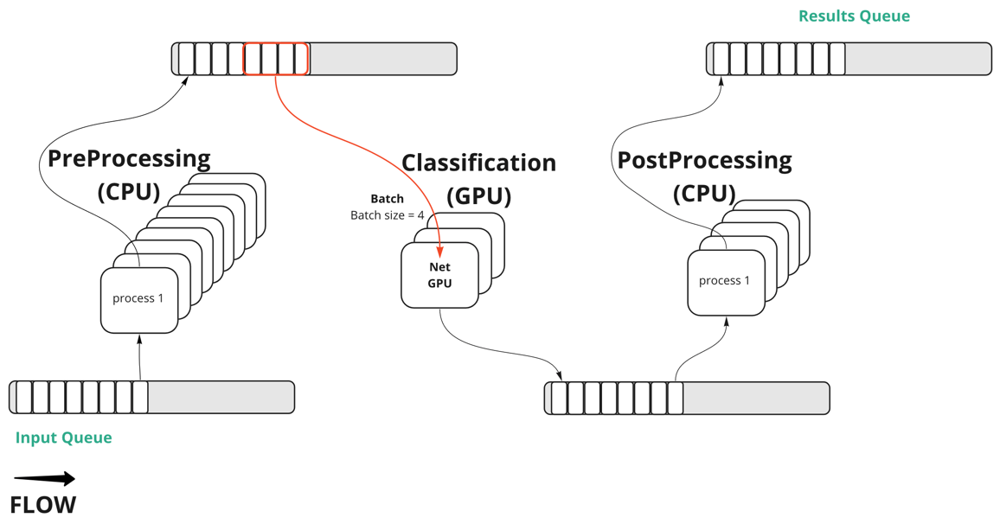

# Aqueduct

Framework for creating efficient data processing pipelines.

## Contact
Feel free to ask questions in telegram [t.me/avito-ml](https://t.me/avito_ml)

## Key Features

- Increase RPS (Requests Per Second) for your service
- All optimisations in one library
- Uses shared memory for transfer big data between processes


## Main concept



## Get started

Simple example how to start with aqueduct. For a better understanding see [examples](examples).

```python
import asyncio
import contextlib
from typing import Optional

from aqueduct import (
    Flow,
    FlowStep,
    BaseTaskHandler,
    BaseTask,
    log,
)

log.setLevel('ERROR')


def fib(n: int) -> int:
    """Calculates the nth number in the Fibonacci sequence.
    
    Specially not optimal in time.
    """
    if n < 2:
        return n
    return fib(n - 1) + fib(n - 2)


class Task(BaseTask):
    def __init__(self, serial_number: int):
        super().__init__()
        self.serial_number = serial_number
        self.fib_number: Optional[int] = None


class FibHandler(BaseTaskHandler):
    def handle(self, *tasks: Task):
        for task in tasks:
            task.fib_number = fib(task.serial_number)


@contextlib.contextmanager
def debug_msg():
    """Shows that event loop is not blocked."""
    async def print_msg():
        while True:
            print('event loop is not blocked')
            await asyncio.sleep(1)
    f = asyncio.ensure_future(print_msg())
    yield 
    f.cancel()


@contextlib.asynccontextmanager
async def run_flow():
    flow = Flow(FlowStep(FibHandler(), nprocs=6), metrics_enabled=False)
    flow.start()
    yield flow
    await flow.stop(graceful=False)


async def main():
    """Calculates 6 numbers from the Fibonacci sequence.
    
    Thanks to Aqueduct, we do this in parallel for each number and without blocking the event loop.
    Flow has the simplest architecture and consists of only one step with the calculation of the Fibonacci number.
    
    Using an Aqueduct in this case is equivalent to using the following code:
    
    with debug_msg():
        loop = asyncio.get_running_loop()
        with concurrent.futures.ProcessPoolExecutor(6) as pool:
            tasks = [loop.run_in_executor(pool, fib, i) for i in range(30, 36)]
            results = await asyncio.gather(*tasks)
            print({i: fib_number for i, fib_number in zip(range(30, 36), results)})
    """
    with debug_msg():
        tasks = [Task(i) for i in range(30, 36)]
        async with run_flow() as flow:
            await asyncio.gather(*[flow.process(task, timeout_sec=10) for task in tasks])
        print(*[{task.serial_number: task.fib_number} for task in tasks])


asyncio.run(main())
```

## Batching
Aqueduct supports the ability to process tasks with batches. Default batch size is one.
```python
import asyncio
import time
from typing import List

import numpy as np

from aqueduct.flow import Flow, FlowStep
from aqueduct.handler import BaseTaskHandler
from aqueduct.task import BaseTask

# this constant needs just for example
TASKS_BATCH_SIZE = 20


class ArrayFieldTask(BaseTask):
    def __init__(self, array: np.array, *args, **kwargs):
        super().__init__(*args, **kwargs)
        self.array = array
        self.result = None


class CatDetector:
    """GPU model emulator that predicts the presence of the cat in the image."""
    IMAGE_PROCESS_TIME = 0.01
    BATCH_REDUCTION_FACTOR = 0.7
    OVERHEAD_TIME = 0.02
    BATCH_PROCESS_TIME = IMAGE_PROCESS_TIME * TASKS_BATCH_SIZE * BATCH_REDUCTION_FACTOR + OVERHEAD_TIME

    def predict(self, images: np.array) -> np.array:
        """Always says that there is a cat in the image.

        The image is represented by a one-dimensional array.
        The model spends less time for processing batch of images due to GPU optimizations. It's emulated
        with BATCH_REDUCTION_FACTOR coefficient.
        """
        batch_size = images.shape[0]
        if batch_size == 1:
            time.sleep(self.IMAGE_PROCESS_TIME)
        else:
            time.sleep(self.IMAGE_PROCESS_TIME * batch_size * self.BATCH_REDUCTION_FACTOR)
        return np.ones(batch_size, dtype=bool)


class CatDetectorHandler(BaseTaskHandler):
    def handle(self, *tasks: ArrayFieldTask):
        images = np.array([task.array for task in tasks])
        predicts = CatDetector().predict(images)
        for task, predict in zip(tasks, predicts):
            task.result = predict


def get_tasks_batch(batch_size: int = TASKS_BATCH_SIZE) -> List[BaseTask]:
    return [ArrayFieldTask(np.array([1, 2, 3])) for _ in range(batch_size)]


async def process_tasks(flow: Flow, tasks: List[ArrayFieldTask]):
    await asyncio.gather(*(flow.process(task) for task in tasks))


tasks_batch = get_tasks_batch()
flow_with_batch_handler = Flow(FlowStep(CatDetectorHandler(), batch_size=TASKS_BATCH_SIZE))
flow_with_batch_handler.start()

# checks if no one result
assert not any(task.result for task in tasks_batch)
# task handling takes 0.16 secs that is less than sequential task processing with 0.22 secs
await asyncio.wait_for(
    process_tasks(flow_with_batch_handler, tasks_batch), 
    timeout=CatDetector.BATCH_PROCESS_TIME,
)
# checks if all results were set
assert all(task.result for task in tasks_batch)

await flow_with_batch_handler.stop()

# if we have batch size more than tasks number, we can limit batch accumulation time 
# with timeout parameter for processing time optimization
tasks_batch = get_tasks_batch()
flow_with_batch_handler = Flow(
    FlowStep(CatDetectorHandler(), batch_size=2*TASKS_BATCH_SIZE, batch_timeout=0.01)
)
flow_with_batch_handler.start()

await asyncio.wait_for(
    process_tasks(flow_with_batch_handler, tasks_batch), 
    timeout=CatDetector.BATCH_PROCESS_TIME + 0.01,
)

await flow_with_batch_handler.stop()
```


## Sentry
The implementation allows you to receive logger events from the workers and the main process.
To integrate with __Sentry__, you need to write something like this:
```python
import logging
import os

from raven import Client
from raven.handlers.logging import SentryHandler
from raven.transport.http import HTTPTransport

from aqueduct.logger import log


if os.getenv('SENTRY_ENABLED') is True:
    dsn = os.getenv('SENTRY_DSN')
    sentry_handler = SentryHandler(client=Client(dsn=dsn, transport=HTTPTransport), level=logging.ERROR)
    log.addHandler(sentry_handler)
```
