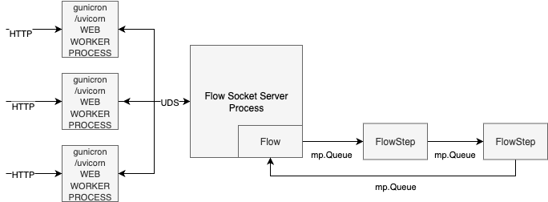
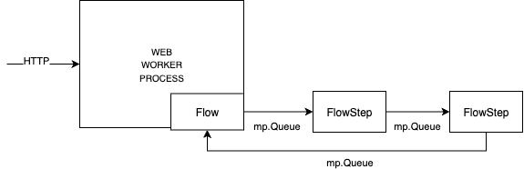

Web Concurrency Example
#######################

When building a web service with Aqueduct, you may need to scale your application by running multiple concurrent web workers.

The main motivation for enabling concurrency is to avoid bottlenecks in the main process. Typically, the main process is responsible for handling HTTP requests, managing serialization and deserialization, performing data validation and conversion, and, when using Aqueduct, running the Flow instance along with its utility functions.

To improve scalability, a common setup is to run multiple concurrent web workers sharing a single aqueduct.Flow instance.

For this scenario, we recommend using Gunicorn with the preload_app feature, combined with a standalone process that manages a single Flow instance. The web workers communicate with this process via Unix Domain Sockets.

This standalone Flow process handles tasks from all workers. The diagram below illustrates the difference:

Old scheme (without a dedicated Flow process):

Implementation Guide
-------------------

Concurrency with Gunicorn + FastAPI

Follow these steps to enable concurrency in your Aqueduct-based service:

1. Install Gunicorn (and Uvicorn workers)
=========================================

 Add Gunicorn to your project dependencies.
 See the official installation `guide<https://docs.gunicorn.org/en/latest/install.html>`__.

 Since this example uses Uvicorn workers for Gunicorn, also install Uvicorn:

 .. code-block:: bash

    pip install uvicorn

2. Refactor your app to use SocketFlow
======================================

 Let’s start with a basic example.

 `flow.py`:

 .. code-block:: python

    from aqueduct.flow import Flow, FlowStep
    from aqueduct.handler import BaseTaskHandler
    from aqueduct.task import BaseTask

    class Task(BaseTask):
        def __init__(self):
            super().__init__()
            self.result = None

    class Handler(BaseTaskHandler):
        def handle(self, *tasks: Task):
            for task in tasks:
                task.result = 'done'

    def build_flow() -> Flow:
        return Flow(
            FlowStep(
                Handler(),
            ),
        )

 Original main.py using a standard Flow:

 .. code-block:: python

    from typing import Optional

    from aqueduct.sockets.flow import SocketFlow
    from fastapi import FastAPI
    from pydantic import BaseModel

    from flow import Handler, Task, build_flow

    mp_flow = build_flow()

    # Start Flow
    # Initialize flow step processes. Initialize Flow utility (metrics, result awaiting, etc.)
    app = FastAPI(on_startup=[mp_flow.start])

    class GetResultResponse(BaseModel):
        result: Optional[str]

    @app.get('/get_result')
    async def get_result() -> GetResultResponse:
        task = Task()
        print(task.result)  # None
        await mp_flow.process(task)
        print(task.result)  # 'done'
        return GetResultResponse(result=task.result)

 Now simply replace the Flow with SocketFlow which is compatible with concurrency in "single-instance" mode:

 .. code-block:: python

    from typing import Optional

    from aqueduct.sockets.flow import SocketFlow
    from fastapi import FastAPI
    from pydantic import BaseModel

    from flow import Handler, Task, build_flow

    socket_flow = SocketFlow()

    # Start SocketFlow wrapper
    # Initialize socket connection pool to communicate with flow socket server
    app = FastAPI(on_startup=[socket_flow.start])

    class GetResultResponse(BaseModel):
        result: Optional[str]

    @app.get('/get_result')
    async def get_result() -> GetResultResponse:
        task = Task()
        print(task.result)  # None
        await socket_flow.process([task])  # Send batch of tasks via socket
        print(task.result)  # 'done'
        return GetResultResponse(result=task.result)

3. Define Gunicorn config with `preload_app` flag

 The key is to initialize the Flow once, in the Gunicorn master process.
 This way, Gunicorn spawns web workers via fork, and all business logic objects created during the preload stage are shared across workers thanks to the Copy-on-Write mechanism.

 See:
  * `About preload_app<https://docs.gunicorn.org/en/stable/settings.html#preload-app>`__
  * `About on_starting hook<https://docs.gunicorn.org/en/21.2.0/settings.html#on-starting>`__

 gunicorn_config.py:

 .. code-block:: python

    import os
    import signal

    from main import build_flow, socket_flow

    # GUNICORN CONFIG
    bind = os.getenv('SERVICE_HOST', '0.0.0.0') + ':' + os.getenv('SERVICE_PORT', '8890')
    workers = os.getenv('WEB_CONCURRENCY', 2)
    worker_class = 'uvicorn.workers.UvicornWorker'
    wsgi_app = 'main:app'
    preload_app = True

    # PRELOAD APP
    flow_socket_server_proc_ctx = None

    def on_starting(server):
        global flow_socket_server_proc_ctx
        # Initialize Flow steps and Flow socket server with its steps only once
        flow_socket_server_proc_ctx = socket_flow.preload(build_flow())

    def on_exit(server):
        if flow_socket_server_proc_ctx:
            for process in flow_socket_server_proc_ctx.processes:
                os.kill(process.pid, signal.SIGKILL)

Run example
-----------

Old command:

.. code-block:: bash

    uvicorn main:app

New command:

.. code-block:: bash

    gunicorn -c gunicorn_config.py

